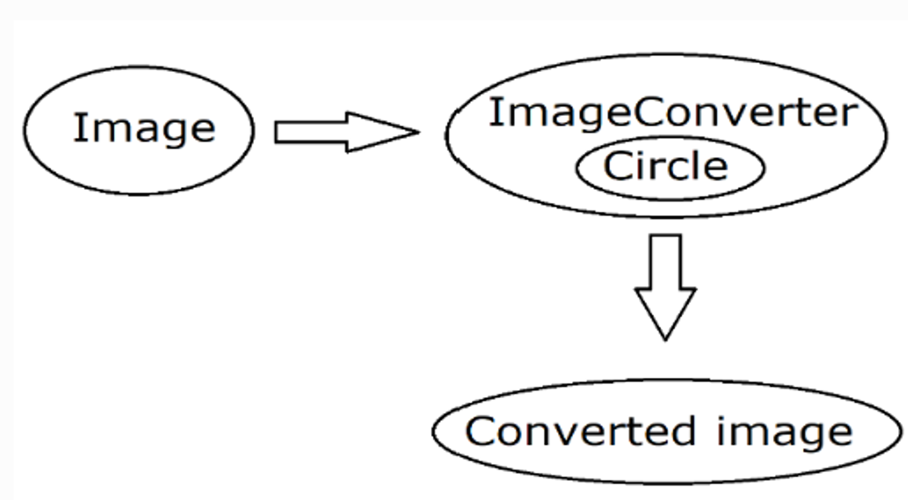

Introduction
==============

The topic we have chosen is **'pixels to circles'.** |br|
The assignment is as follows: 

::  
    
    Pixels to circles* 

    As an input, a two-dimensional image or landscape is given by an n x n square of black-and-white 
    pixels.

    Your code should create an approximation of this landscape by a set of superimposed circular disks. 
    It should aim at the best possible accuracy for a given maximum number of circular disks that can
    be varied as part of the input. It should also be able to generate a lossless representation of 
    the image/landscape using an unlimited number of circular disks.

Our **method** to deal with the task at hand was ..... |br|

blablabla

**Flowchart of our main classes** |br|

**Image** class: |br|

 - imports the picture
 - extracts length and width
 - calculates the values needed 

**Circle** class: |br|

 - Receive values
 - Sets values

**Imageconverter** class: |br|

 - Sets the algorithms
 - Placement of circles
 - reads information from image
 - List of circles (objects) 
 

.. |br| raw:: html

    