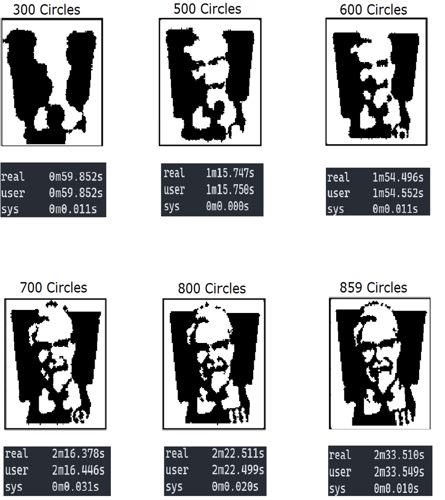

Results
=======

To test the algorithms, a binary image of the KFC logo was converted to 1's and 0's. |br|

.. image:: images/kfc_converter.png

**Bogo place** |br|
As this algorithm is a random, worst case scenario algorithm, the test results was as expected, totally random in the range from
all white to all black. As shown, run with both 20 circles and 1000, the results makes no sense in comparison with the original picture.
In turn, this makes alot of sense as this is an *all* random algorithm. 

**Bogo feedback - Circle version** |br| 
Even though the results shown is not subpar, the performance is. 
If this version is run with for example 1500 circles, it might not even finish running, as bogo place is still 
randomly placed. As shown in the examples, the runtime of 1000 circles is still under 1 second, but 1500 circles was aborted
after 3 minutes and 25 seconds. 

.. image:: images/kfc_test_modbogo_group.png

**Bogo feedback - Accuracy version** |br|
The second version of the modded bogo place. This algorithm place circles at random until the desired accuracy is hit. 
This algorithm gave more desirable results and is easier to handle as you can decide the accuracy yourself, instead of having
to 'pick and place' with *x* amount of circles for subpar results with the Circle version.

**Directed random place**  |br|
This algorithm has two main changes from the Bogo feedback, for every circle, the algorithm will iterate through *n* number
of circles of the biggest size. For every circle, it compares the difference by placing a white or black circle. 
When it places a circle, *n* will be set to 0, if it does not, it will change *n* to 1. 
When the radius is 1, it will iterate through until it cannot find any more circles to place after *n+1* attempts. 
This algorithm takes longer to compute than the other two algorithms, but it is a more thorough algorithm than the others.
It breaks the process in the area of 820-900 circles as it seems like it is happy with the results that is achieved by then.  |br|

.. |br| raw:: html

    