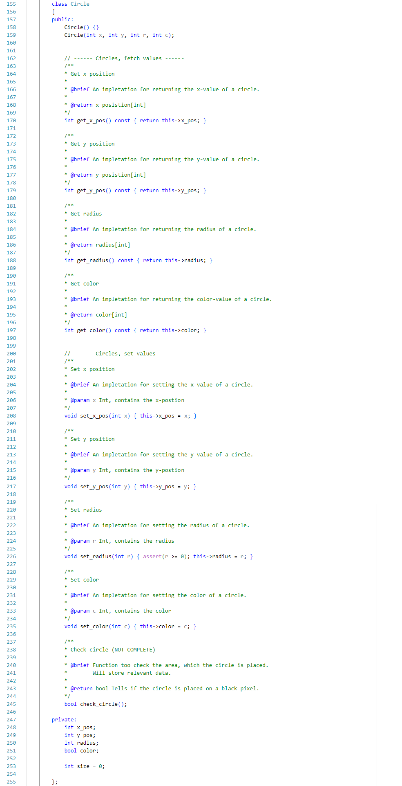

Scripts
========

``Circle`` 

.. image:: images/circlecpp.png

``Circle Header`` 

``Image``

.. image:: images/imagecpp1.png

``Image header`` 

``ImageConverter`` 

print screen her? code block? 

dependencies? 

asdfasdfasd
