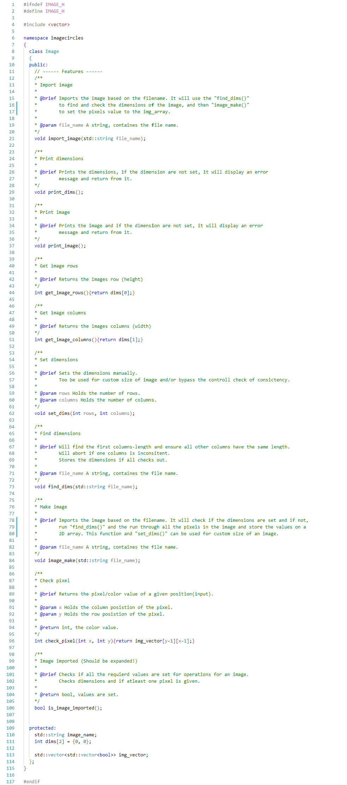
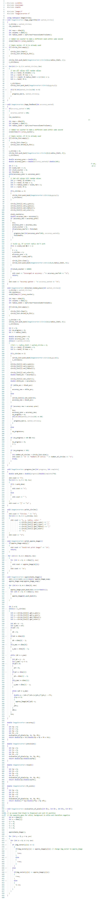

Scripts
========

Related to Image
---------------------

``Image.cpp`` 

``Image.h`` 

Related to ImageConverter
------------------------------

``imageconverter.cpp`` 

``imageconverter.h`` 

Related to Circle
------------------------

``imageconverter.cpp`` Circle class

.. image:: images/circlecpp.png

``imageconverter.h`` Circle Header

.. image:: images/circleh.png

